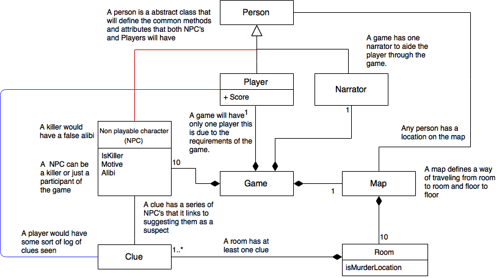

Architecture
====================

Overview
---------
To explain the architecture of our game we decided to use UML 2.X [1] as
this allowed us to create a clear diagram of how our game should be
architected. We have annotated where possible explaining the
relationship between objects and explained some of the attributes. The
tool we used to design the diagram was initially pen and paper however
we later decided upon the use of Draw.io[2]  as this allowed us to
collaboratively design the achitechture online.

Before starting the design of the architecture we first sat down and
worked out how the game would work in practice. Creating scenarios and
planning how the game would play through with each scenario. This helped
us decide what the main objects of the game would be.

We began designing a simplified UML diagram, showing only the classes
and high level relationships, as this allowed us to work out the
different objects we needed for the game, and clearly visualise how they
relate to each other. This diagram was intentionally kept simple for
clarity, and it allowed us to start thinking about the structure of the
game in the simplest terms possible. This then gave us a clearer picture
of how the structure of the game worked, and allowed us to move on to
producing a more complex UML diagram that we can use for reference later
on when implementing the game.

.. image:: images/ArchDiagram1.png

The structure that was presented by the simplified UML diagram served as
a base for our final UML diagram. The UML diagram was produced based on
our previous thinking, and it expanded upon the detail about the
components and objects of the game we had planned before. We started map
out the key classes and properties, and worked out how we could use
abstract classes and inheritance to improve code reuse and aid with the
implementation process.

Below is our UML diagram. We’ve used a few non-standard
additions to the diagram to clarify our thinking. We’ve put comments
across the diagram alongside relationship lines and classes to explain
what we meant by the relevant parts. Also we have colour coded
intersecting lines to show the differentiation between the two (we were
unable to get “bridges” over the lines in our diagramming tool!)

Justification
--------------
The game will be made up of many classes, and these classes will have
relationships to each other, as described previously. This structure is
useful for the implementation process, as it allows relevant parts of
the game to be isolated and available for reuse elsewhere. Having a
strictly defined structure also aids with maintainability and ability to
add new features, as developers can find the code they are looking for.

Game
~~~~~~~~~~~~~~
A game is a class that provides the entry point to the game logic. It
contains methods that render and initialise the game ready for use by a
user, and manages the state of the game as it progresses. This class is
necessary to contain the game logic, and will provide a common area to
place shared game logic.

Person
~~~~~~~~~~~~~~
A person is an abstract class that will define the common methods and
attributes that both NPC's (see below) and a player will have. These
include a relationship to the map to allow for common location
attributes and methods to be shared, and other rendering methods. This
will help prevent unnecessary code duplication, this will also allow us
to expand the game further in the future if required adding new people
that require the same functions.

Player
~~~~~~~~~~~~~~
The game has one player, which represents the user interacting with the
game. The player class extends the person class to allow for code reuse.
The player contains attributes such as their score, and contains a list
of clues the player has picked up. A player can also be in a room within
the  map. This class is necessary to contain logic related to the user,
and to keep relevant user details and status for use within the game.

The player will contain details about previous types of questions asked
to NPCs, this is to allow the development his/her personality as the
game goes on.

Non-Playable Character (NPC)
~~~~~~~~~~~~~~
A non-playable character (referred to as NPC) is one of the fictional
people represented within the game. There will be 10 NPCs in the game.
All NPCs have associated clues that point to them as a suspect.

At the start of a game, each NPC will be associated with a room within
the  map, and they can be questioned in that room by the player. The NPC
contains the questioning data, including the possible questions that a
player can ask and the NPC’s response.

For every game, an NPC is selected as the killer from a subset of the
NPCs that can be killers. The same process happens for selecting the
victim. A subset of all the NPCs can be possible killers or victims -
this is to reduce the number of storylines that need developing, and can
be expanded later on.

All NPCs have a motive (a reason why they would kill the victim) and all
NPCs except the killer have an alibi (what they were doing at the time
of the murder). This is to allow the game to change the murder scenario
every time it is played.

Narrator
~~~~~~~~~~~~~~
There is one narrator in the game, we chose not to have the narrator as
another NPC in the game as the narrator serves a different purpose,
requiring different methods and attributes to a NPC. The purpose of the
narrator is to introduce the game to the player, the control scheme and
instructions on how the game works.

Map
~~~~~~~~~~~~~~
This is a representation of the map within the game that a player can
navigate around. A map contains many rooms arranged in a specific way,
and provides methods and  attributes that allow for navigation. There
will be 10 rooms in a map, however the way the map class is designed it
will allow more rooms to be added or taken away easily.

Rather than giving the game a series of rooms we decided to create a map
class that would handle how these rooms linked to each other, this makes
it easy to provide methods to the game and the player that mean if we
were to add new rooms or change the map the game logic wouldn’t need to
be altered.

Room
~~~~~~~~~~~~~~
A room is a place within a map that a player can visit. This class will
contain methods and attributes that will allow other parts of the game
to interact with the room where necessary.

At the start of the game, each room has a random NPC assigned to it, and
one or more clues associated with the killer NPC assigned to it. The
player can visit the room to gather information by talking to the
assigned character, or finding the clues located in the room.

Clue
~~~~~~~~~~~~~~
A clue is an object within the game that allows the player to narrow
down their list of suspect NPCs. Every NPC has a set of clues, and these
point to the NPC as a suspect. Some of these clues are shared amongst
multiple characters, for example “a blond hair”, that will allow the
player to narrow down the set of suspects.

At the start of each game, every clue associated with the killer NPC is
assigned to a room, so when the player visits a room they can collect
any clues located in the room.

The clue class is essential to the game as it provides the mechanism for
deducting which NPC is the killer in the game.

Bibliography
-------------

[1] OMG Unified Modeling Language TM (OMG UML) Version 2.5 [Online]
 Available http://www.omg.org/spec/UML/2.5/PDF/  [Accessed 25/10/2016]

[2] Draw.io, “Flowchart Maker & Online Diagramming Software” [Online]
 Available https://draw.io/  [Accessed 25/10/2016]